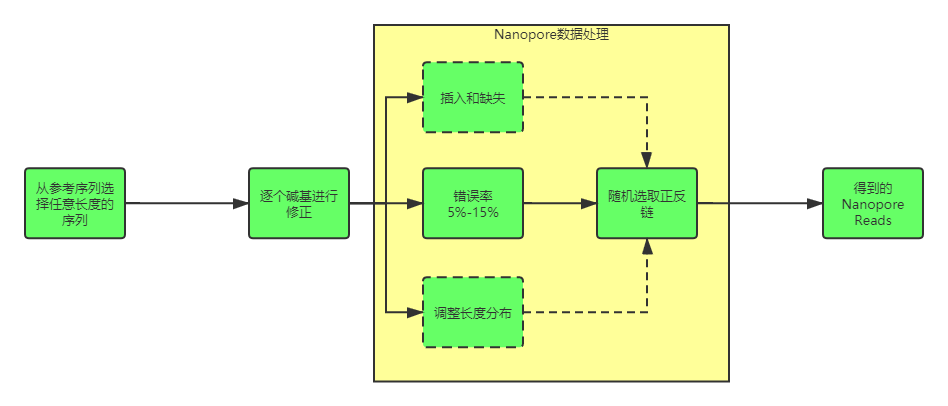
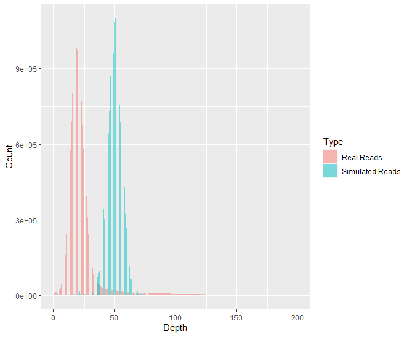
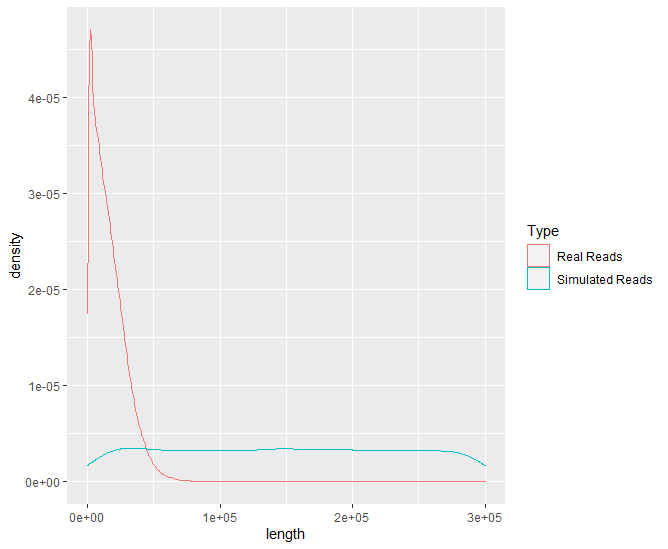

# 用于组装的测序数据模拟

## 参考数据选择

选择拟南芥1个Cell的Nanopore组装结果:

>Michael, Todd P., et al. "High contiguity Arabidopsis thaliana genome assembly with a single nanopore flow cell." Nature communications 9.1 (2018): 541.

- 基因组大小: 119,502,799 bp
- Contig N50: 12,334,794 bp
- Contig数: 62

### 选择了最长的Contig
OMOL01000003.1

长度：14,864,299 bp

### 将真实的测序数据比对到Contig

```sh
minimap2 -ax map-ont -t 10 TAR10.1.OMOL01000003.1.fa ERR2173373.sra.fastq | samtools view -bS | samtools sort > ERR2173373.contig.bam
```
获得99,116条比对上的Reads进行后续的特征评估

## 数据模拟流程
按照如下流程生成5,000条序列


## 初步模拟得到的数据特征评估
|参数|真实数据|模拟数据|
|---|---|---|
|毛深度|106x|50x|
|全局错配率|9.53%|9.48%|
|最长Reads长度|135329|299976|
|平均Reads长度|16021.84||148723.3|
|Reads长度中位数|13350|148602|
|**平均碱基质量**|15|40|
|平均插入错误|||
|平均删除错误|||

### 比对深度比较




### Reads长度比较



**需要将长度设置在一定范围内，使其符合正态分布**